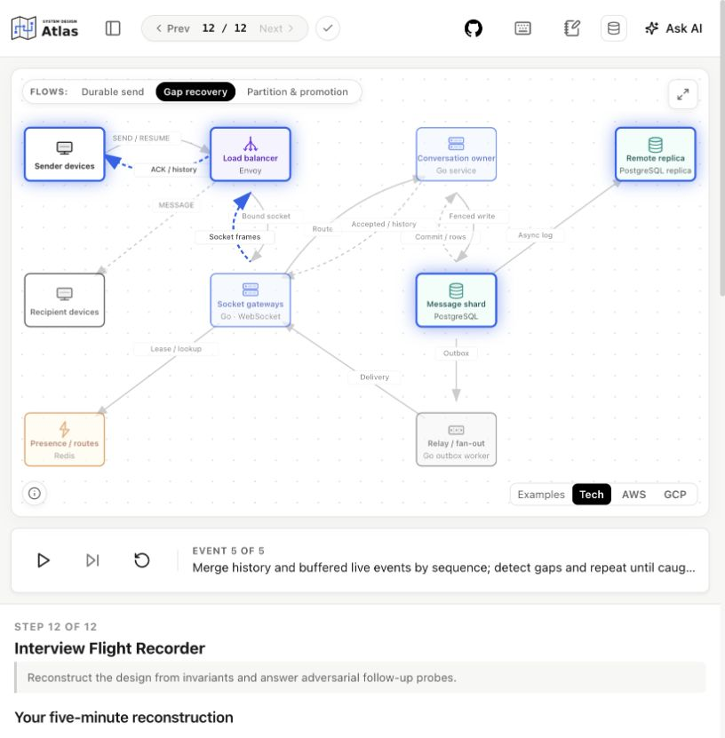

# System Design Atlas

[](LICENSE)
[](https://react.dev/)
[](https://www.typescriptlang.org/)
[](https://vitejs.dev/)

An interactive, decision-driven system design curriculum and architecture simulator built for engineers with 10+ years of experience preparing for senior, staff, and principal technical interviews at tier-one tech companies.

**[Explore System Design Atlas →](https://systemdesign.tamilarasu.dev/)**

[](https://systemdesign.tamilarasu.dev/archetypes/chat/steps/recap)

---

## Key Highlights

- 🖥️ **Split Learning Surface**: Desktop-first layout with interactive SVG architecture diagrams on the left and an adjustable 260–750px explanation and challenge pane on the right.
- ⚡ **Animated Request Flows**: Multi-sequence packet animations (`Cache Hit`, `Cache Miss`, `Write Path`) that auto-play to illustrate distributed data paths step-by-step.
- 🎯 **Decision-Based Learning**: Interactive interview challenges following the `Predict → Choose → Simulate → Explain → Retry` loop, evaluating real trade-offs and edge cases under peak loads.
- 📝 **Dual-Scope Study Notes**: Candidate notes for either the active step or the entire chapter, auto-saved to browser storage and exportable via YAML.
- 🔍 **Real URLs & Static Prerendering**: HTML5 History push-state routing (`/archetypes/url-shortener/steps/cache/`, `/concepts/cache/`) with build-time static HTML prerendering, automated sitemap, and robots.txt for search engine indexing.
- 💾 **Safe Local Progress**: Local browser progress tracking without a login with schema migrations, reset confirmation, and YAML import/export transfer.
- 🤖 **Contextual AI Assistant**: Pre-formatted, prompt-engineered templates for ChatGPT, Claude, and Gemini populated with current step context, architecture state, and trade-offs.

---

## Available Content

| Chapter | Stage | Steps | Status |
|---|---|---|---|
| **URL Shortener** | Foundation | 9 Interactive Steps | ✅ **Available** |
| **Product Catalog** | Foundation | — | 📋 Planned |
| **Photo Sharing & Video Delivery** | Foundation | — | 📋 Planned |
| **Notification Service** | Foundation | — | 📋 Planned |
| **Home Timeline** | Foundation | — | 📋 Planned |
| **Product Search & Autocomplete** | Foundation | — | 📋 Planned |
| **Real-Time Chat** | Foundation | 12 Interactive Steps | ✅ **Available** |
| **Ticket Booking** | Foundation | — | 📋 Planned |
| **Checkout & Payments** | Foundation | — | 📋 Planned |
| **Event Streams & Analytics** | Advanced | — | 📋 Planned |
| **Location & Matching** | Advanced | — | 📋 Planned |
| **Distributed Infrastructure** | Advanced | — | 📋 Planned |
| **Collaborative Editing** | Advanced | — | 📋 Planned |
| **LLM Request/Response Apps** | GenAI | — | 📋 Planned |
| **Conversational Assistants** | GenAI | — | 📋 Planned |
| **Retrieval-Augmented Generation** | GenAI | — | 📋 Planned |
| **Tool-Using Agents & Workflows** | GenAI | — | 📋 Planned |
| **Real-Time Multimodal Agents** | GenAI | — | 📋 Planned |
| **Asynchronous Generation Pipelines** | GenAI | — | 📋 Planned |
| **Model Serving & AI Gateways** | GenAI | — | 📋 Planned |

The authoritative list lives in [`src/archetypes/catalog.ts`](src/archetypes/catalog.ts); planned chapters are labeled `availability: 'planned'` and are never rendered as lessons until implemented.

---

## Quickstart

### Prerequisites
- Node.js 22 (matching CI)
- npm 10+

### Installation & Development
```bash
# Clone the repository
# Clone your fork, then change into its directory.

# Install dependencies
npm ci

# Start Vite dev server
npm run dev
```
Open [http://localhost:5173](http://localhost:5173) in your browser.

---

## Available Scripts

| Command | Description |
|---|---|
| `npm run dev` | Starts Vite local development server with HMR. |
| `npm run build` | Compiles TypeScript, bundles Vite production assets, and prerenders all static HTML pages. |
| `npm run prerender` | Re-runs only the static HTML/sitemap prerender step against an existing `dist/`. |
| `npm run preview` | Previews the production build locally. |
| `npm run typecheck` | Type-checks the entire TypeScript codebase (`tsc --noEmit`). |
| `npm run lint` | Runs ESLint with the flat config (`--max-warnings 0`). |
| `npm run test:build` | Checks generated HTML after `npm run build`. |
| `npm test` | Runs unit tests using Vitest. |
| `npm run test:watch` | Runs Vitest in watch mode. |
| `npm run test:e2e` | Runs Playwright end-to-end integration and visual verification tests. |

---

## Adding New Chapters

System Design Atlas is designed as a reusable framework. Adding a new archetype does not require recreating components from scratch:

1. **Read the Master Guide**: Open **[`docs/authoring-archetypes.md`](docs/authoring-archetypes.md)**.
2. **Author with AI**: Copy the built-in Master Prompt into ChatGPT or Claude to generate complete, mathematically grounded curriculum specs.
3. **Implement**: Give a coding agent the generated spec and the guide’s handoff prompt to scaffold components, diagrams, and tests using the reusable primitives (`@/components/lesson/StepComponents` and `@/utils/diagram-builder`).
4. **Register**: Add the chapter in `src/archetypes/catalog.ts`, `src/archetypes/registry.ts`, and `src/archetypes/step-manifests.ts`.
5. **Verify**: Run every acceptance command and desktop review in the guide.

---

## Architecture & Technology

```
src/
├── app/               # Application router (real paths & hash redirects)
├── archetypes/        # Chapter implementations and catalog
│   ├── catalog.ts     # Metadata for all available and planned archetypes
│   ├── registry.ts    # Lazy loading registry
│   └── url-shortener/ # Complete reference archetype implementation
├── components/        # Reusable UI building blocks
│   ├── challenge/     # Interactive decision challenge widgets
│   ├── chat/          # AI prompt dialog & provider selectors
│   ├── diagrams/      # SVG architecture canvas, nodes, edges & flow player
│   ├── layout/        # App shell, unified top toolbar, toolbar context
│   ├── lesson/        # Shared step typography, callouts, cards, code blocks
│   ├── notes/         # Study notes modal with step & chapter scopes
│   └── ui/            # Buttons, dialogs, drawers, toasts
├── concepts/          # Canonical concept definitions (cache, database, etc.)
├── features/          # Progress storage, validation, YAML transfer, chat assist
├── hooks/             # Custom React hooks (useProgress, useLessonNavigation)
├── styles/            # Global design tokens (tokens.css)
├── types/             # Shared TypeScript interfaces
└── utils/             # Diagram builder, Base62 encoders, prerender helpers
```

### Design Principles
- **Dependency Flow**: Pages $\rightarrow$ Features/Components $\rightarrow$ Types/Utils. Chapters never import another chapter's private files.
- **Design Tokens**: Standard CSS custom properties in `src/styles/tokens.css` without arbitrary hardcoded colors.
- **Accessibility**: Semantic HTML, ARIA dialogs/roles, keyboard shortcuts (`N` for notes, `B` for outline, `M` for complete, `?` for help).

---

## Contributing

Contributions from the distributed systems community are welcome! Please read **[`CONTRIBUTING.md`](CONTRIBUTING.md)** for details on coding standards, testing requirements, and the Pull Request process.

---

## License

This project is licensed under the [MIT License](LICENSE).

Challenge outcomes are authored teaching scenarios, not live load tests or measured infrastructure benchmarks. The app copies prompts to external AI services only through user actions; those services have their own data policies.
